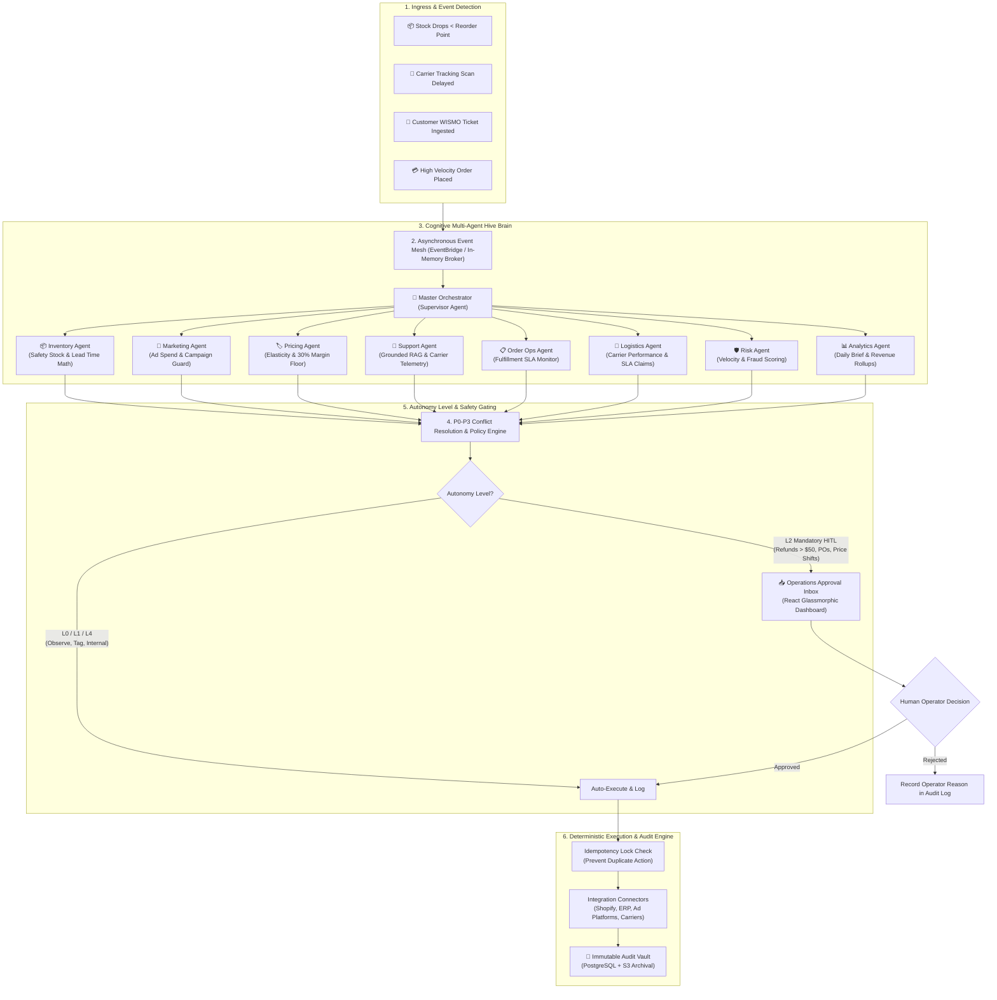

# 🧠 Apex Labs — AI-Powered Autonomous E-Commerce Operations Platform

[](apps/api/)
[](apps/web/)
[](brain/)
[](apps/api/models.py)
[-FF9900.svg?style=flat&logo=amazon-aws)](infra/)
[](docker-compose.yml)
[](brain/shared/policy_engine.py)

---

## 📌 Executive Summary

Modern e-commerce brands and retailers operate in extreme fragmentation. Catalog management, demand forecasting, customer support, marketing campaigns, dynamic repricing, warehouse fulfillment, and carrier logistics exist across disconnected software silos. Human operators spend hundreds of hours manually synchronizing data across dashboards, causing delayed responses, inventory stockouts, wasted ad spend, customer churn, and margin leakage.

**Apex Labs AI-Powered Autonomous E-Commerce Operations Platform** is an enterprise-grade, event-driven multi-agent platform designed to autonomously observe retail events, run deterministic mathematical models, generate policy-validated action proposals, require human sign-off for high-risk operations, and execute actions with an immutable audit trail.

---

## 🚨 Problem Statement: The E-Commerce Fragmentation Crisis

Every day, high-volume retail operations bleed millions of dollars due to cross-silo latency:

```
                  ┌─────────────────────────────────────────────────────────┐
                  │          THE SILOED E-COMMERCE CRISIS                   │
                  └─────────────────────────────────────────────────────────┘
      ┌─────────────────────────┬─────────────────────────┬─────────────────────────┐
      │  Inventory Blindspot    │   Ad Budget Waste       │  Support Hallucinations │
      │  Runout velocity spikes │   Ad campaigns burn     │  Agents promise false   │
      │  undetected; stockout   │   $250+/day pushing     │  ETAs without live      │
      │  causes lost revenue    │   zero-inventory SKUs   │  carrier tracking data  │
      └─────────────────────────┴─────────────────────────┴─────────────────────────┘
      ┌─────────────────────────┬─────────────────────────┬─────────────────────────┐
      │  Crude Dynamic Pricing  │   Carrier Transit Loss  │  Executive Delay        │
      │  Discounts erode gross  │   Stalled shipments go  │  Daily reviews happen   │
      │  margins below 30%      │   unclaimed; SLA refund │  24h late; decisions    │
      │  cost-of-goods floors   │   deadlines expire      │  are reactive, not auto │
      └─────────────────────────┴─────────────────────────┴─────────────────────────┘
```

1. **Inventory Stockouts vs. Dead Stock**: Demand spikes drain stock while supplier lead-time buffers are miscalculated, leading to stockouts on winning products or excess working capital tied up in slow-moving inventory.
2. **Ad Budget Leakage**: Performance marketing teams continue running Google/Meta ad campaigns that drive high-intent traffic to product detail pages that are already out of stock.
3. **Support Bottlenecks & Inaccurate Promises**: Support agents overwhelmed by WISMO ("Where is my order?") tickets guess delivery dates or execute manual refunds without policy verification.
4. **Margin Erosion**: Rule-based pricing tools enter race-to-the-bottom price wars, violating gross margin floors and damaging brand equity.
5. **Carrier SLA Leakage**: Packages delayed at regional carrier hubs are not detected in time to claim guaranteed transit delay reimbursements.

---

## 💡 How Apex Solves It: Architectural Principles

### 1. Separation of Cognitive Reasoning and Deterministic Execution
Language models are probabilistic engines. They should **never** have direct write access to production database tables or third-party bank/payment APIs. In Apex, LLMs (Gemini / Claude) propose structured, schema-validated JSON actions (`ActionProposal`). These proposals must pass through a deterministic, hard-coded **Policy Engine** before execution.

### 2. Zero-Hallucination Deterministic Mathematics
Calculations for safety stock, lead-time demand, days of cover, price elasticity, contribution margins, and carrier multi-attribute scorecards are computed in verified Python functions — **not** by LLM text generation.

### 3. Autonomy Levels (L0 to L4) with Human-in-the-Loop (HITL)
Every action proposal is classified by autonomy level. Low-risk actions (e.g., tagging a ticket) can execute autonomously (L4), while monetary or destructive side effects (purchase orders, refunds > $50, price adjustments) require explicit human approval via the **Operations Approval Inbox** (L2).

### 4. P0–P3 Priority Conflict Resolution Matrix
When multiple agents compete for actions on the same entity, the Master Orchestrator enforces a strict priority hierarchy:
- **P0 (Safety & Inventory Guardrails)**: *Trumps everything.* If stock is critical, freeze discounts and halt ad campaigns immediately.
- **P1 (Order Fulfillment & SLA)**: Ensures commitments to active customers override cost-cutting.
- **P2 (Dynamic Margin Optimization)**: Enforces a strict 30% gross contribution margin floor.
- **P3 (Growth & Marketing)**: Scaled up only when inventory and logistics health pass validation.

### 5. Grounded RAG Support Desk
The Support Agent executes vector search over company return policies, warranty documents, and live carrier tracking webhooks, citing exact policy documents and tracking timestamps before staging customer responses.

---

## 🔄 End-to-End Workflow Diagram



---

## 🤖 Specialist Multi-Agent Roster

| # | Specialist Agent | Domain & Purpose | Core Mathematical Formula / Rule | Autonomy & Action Types |
|---|---|---|---|---|
| **0** | **Master Orchestrator (Supervisor)** | Central dispatcher. Evaluates event dependencies, runs parallel agent graphs, and resolves conflicting proposals. | `P0 (Safety) > P1 (SLA) > P2 (Margin) > P3 (Growth)` | Orchestrates all agents; synthesizes multi-agent responses |
| **1** | **Inventory Agent** | Forecasts runout velocity, lead times, and generates supplier purchase orders. | $ROP = (V_{daily} \times L_{days}) + (Z \times \sigma \times \sqrt{L})$ | **L2**: `purchase_order.create`, `inventory.transfer` |
| **2** | **Pricing Agent** | Dynamically manages prices to balance sales velocity against contribution margins. | Min Gross Margin $\ge 30\%$; Max Daily Shift $\le \pm 10\%$ | **L2**: `price.update` (includes automated rollback snapshot) |
| **3** | **Customer Support Agent** | RAG-grounded customer service. Ingests live carrier scans and returns policy chunks. | Confidence Tiers: $\ge 0.90$ Auto, $0.75-0.89$ Review, $<0.75$ Escalate | **L2/L3**: `support.send_reply`, `support.tag_update`, `order.refund` |
| **4** | **Order Operations Agent** | Monitors fulfillment queues, flags delayed shipments, and holds suspicious transactions. | Time to Dispatch $> 24\text{h}$ or transit stall $> 48\text{h}$ | **L2**: `order.notify_delay`, `order.hold`, `order.split_shipment` |
| **5** | **Logistics Agent** | Ranks carrier corridors; detects SLA delivery breaches to claim automatic refunds. | $Score = w_1 \cdot Cost + w_2 \cdot ETA + w_3 \cdot Reliability$ | **L2**: `carrier.file_claim`, `shipment.expedite` |
| **6** | **Marketing Agent** | Synchronizes advertising spend with real-time stock levels to stop budget leakage. | $DaysOfCover < 3 \implies \text{Pause Campaign}$ | **L2/L3**: `campaign.pause`, `campaign.budget_shift` |
| **7** | **Risk & Fraud Agent** | Screens orders for card-not-present fraud, velocity anomalies, and address mismatches. | Multi-factor anomaly score $\ge 0.85 \implies \text{Immediate Hold}$ | **L2**: `order.fraud_review`, `payment.void` |
| **8** | **Analytics Agent** | Ingests daily cross-agent events and compiles operational briefs for management. | Daily revenue, return rate, ad ROAS, and SLA breach variance | **L0**: Daily executive briefing & anomaly alerts |

---

## 🛠️ Real Technology Stack

This codebase is 100% verified and built with:

### Control Plane & Backend
- **Framework**: [FastAPI](https://fastapi.tiangolo.com/) (Python 3.11+) with asynchronous ASGI architecture
- **Validation**: [Pydantic v2](https://docs.pydantic.dev/) for strict type enforcement and JSON Schema validation
- **ORM & Data Layer**: [SQLAlchemy 2.0](https://www.sqlalchemy.org/) supporting async engine (`aiosqlite` / `asyncpg`)
- **Server**: [Uvicorn](https://www.uvicorn.org/) high-performance ASGI server

### Frontend Operations Dashboard
- **Library**: [React 19](https://react.dev/) + [TypeScript 5.7](https://www.typescriptlang.org/)
- **Build Tool**: [Vite 6](https://vitejs.dev/) with hot-module replacement
- **Iconography**: [Lucide React](https://lucide.dev/)
- **Styling**: Modern Vanilla Glassmorphism CSS (dark mode, responsive grid, zero external CSS bloat)

### Dual-AI Engine & Fallback Layer
- **Enterprise High-Throughput**: Google Gemini API (`gemini-3.6-flash` / `gemini-3.5-flash`) for low-latency reasoning
- **Complex Multi-Constraint Reasoning**: Amazon Bedrock (`anthropic.claude-3-5-sonnet`)
- **Deterministic Offline Engine**: Built-in rule-based fallback that guarantees 100% test and local operational uptime even without internet access or API keys

### Persistence & Vector Memory
- **Local Dev / Single Instance**: SQLite (`ecom_ai.db` / `ecom_data.db`)
- **Cloud Production**: Aurora Serverless v2 PostgreSQL with `pgvector` for semantic search and document embeddings
- **Caching & Locks**: Redis 7 (idempotency locks, session cache, rate-limiting)

### Infrastructure as Code (AWS CDK v2)
Located in [`infra/lib/`](infra/lib/):
- **`network-stack.ts`**: Multi-AZ VPC, public/private subnets, S3 Gateway Endpoints, NAT Gateways
- **`data-stack.ts`**: Aurora PostgreSQL Serverless v2, S3 Knowledge Base, KMS customer-managed encryption keys
- **`compute-stack.ts`**: ECS Fargate container tasks, EventBridge Custom Event Bus, SQS Agent & Executor queues with Dead-Letter Queues (DLQ)
- **`edge-stack.ts`**: Application Load Balancer (ALB), CloudFront CDN distribution, Amazon Cognito User Pool, AWS WAF rules

---

## 💰 Enterprise Cost Model & Cloud Sizing

The platform has been cost-engineered for production reliability while avoiding cloud bill shock:

### Monthly Workload Baseline
- **Order Volume**: 100,000 orders/month
- **Event Mesh Throughput**: 1,000,000 events/month
- **Agent Invocations**: 200,000 reasoning executions/month

### Itemized AWS Monthly Cost Breakdown

| AWS Service | Production Enterprise Tier (USD) | Staging / Development Tier (USD) | Sizing & Architectural Notes |
|---|---|---|---|
| **ECS Fargate** (API, Web, Workers) | **$250 – $700** | $60 – $180 | Auto-scaled based on SQS queue depth; 2 vCPU / 4 GB tasks |
| **Aurora PostgreSQL Serverless v2** | **$250 – $800** | $50 – $150 | Auto-scales 0.5 to 4 ACUs; automated PITR backups |
| **AI Reasoning (Gemini / Bedrock)** | **$500 – $3,000** | $50 – $300 | Dynamic routing: Gemini Flash for classification, Claude Sonnet for synthesis |
| **ElastiCache Redis** | **$80 – $250** | $15 – $40 | Idempotency locks, embedding cache, session store |
| **EventBridge & SQS (with DLQ)** | **$10 – $80** | $2 – $10 | 1M custom events, message batching, dead-letter storage |
| **S3 & CloudFront CDN** | **$30 – $200** | $5 – $25 | Document knowledge base, export storage, global CDN edge |
| **ALB, API Gateway & AWS WAF** | **$80 – $300** | $20 – $60 | Bot mitigation, rate limiting, SSL termination |
| **VPC Endpoints & Data Transfer** | **$100 – $500** | $15 – $50 | S3 Gateway Endpoint eliminates costly NAT Gateway bandwidth fees |
| **CloudWatch, X-Ray & GuardDuty** | **$100 – $500** | $20 – $80 | Distributed tracing, structured JSON logs, anomaly detection |
| **Cognito, KMS & Secrets Manager** | **$20 – $150** | $5 – $20 | User pools, envelope encryption, automated secret rotation |
| **TOTAL ESTIMATED MONTHLY** | **$1,420 – $6,480 / mo** | **$238 – $915 / mo** | **ROI:** Saves 3–5 FTE ops roles ($15,000–$25,000/mo) |

### 5 FinOps Cost Optimization Strategies
1. **Dynamic Model Routing**: Fast classification and routing are assigned to `gemini-3.6-flash` or `Claude 3.5 Haiku`, reserving larger models only for complex disputes.
2. **Code-First Arithmetic**: Zero LLM tokens are spent on calculations that Python or SQL can compute for free.
3. **VPC S3 Gateway Endpoints**: Eliminates NAT Gateway transfer fees for RAG vector search and knowledge base lookups.
4. **Scheduled Non-Prod Spin-Down**: Staging and dev environments automatically scale to zero outside business hours, cutting 65% of test compute costs.
5. **Compute Savings Plans**: Baseline production Fargate tasks commit to 1- or 3-year Compute Savings Plans for an automatic 25–40% discount.

---

## 📁 Repository Directory Map

```
AI_AUTONOMOUS_ECOM/
├── apps/
│   ├── api/                              # FastAPI Control Plane & Commerce Engine
│   │   ├── main.py                       # FastAPI entrypoint, middleware, static mount
│   │   ├── config.py                     # Environment configuration & autonomy settings
│   │   ├── database.py                   # Async SQLAlchemy session factory & engine
│   │   ├── models.py                     # Database tables (Orders, Products, Tickets, Approvals)
│   │   ├── schemas.py                    # Pydantic v2 data contracts
│   │   ├── auth.py                       # JWT token authentication & role-based access
│   │   └── routers/
│   │       ├── health.py                 # System health check & readiness probe
│   │       ├── dashboard.py              # Operational KPI rollups & real-time counts
│   │       ├── approvals.py              # HITL Operations Inbox (approve / reject)
│   │       ├── agents.py                 # Direct agent invocation & status
│   │       ├── inventory.py              # Inventory levels & restock endpoints
│   │       ├── orders.py                 # Order management & delay triage
│   │       ├── tickets.py                # Support tickets & RAG response endpoints
│   │       ├── pricing.py                # Pricing updates & margin analysis
│   │       ├── products.py               # Catalog management
│   │       └── simulation.py             # Section 24 incident simulation runner
│   └── web/                              # React 19 / Vite Operations Dashboard
│       ├── index.html                    # Single-page application root
│       ├── vite.config.ts                # Vite build and proxy configuration
│       ├── package.json                  # React 19, TypeScript, Lucide React dependencies
│       └── src/                          # Operations UI components & console views
├── brain/                                # Multi-Agent Cognitive Engine
│   ├── supervisor/                       # Master Orchestrator, event router, parallel runner
│   ├── inventory/                        # Safety stock formulas, MOQ PO generator
│   ├── pricing/                          # Contribution margin optimizer & rollback safeguards
│   ├── support/                          # Grounded RAG customer support engine
│   ├── orders/                           # Fulfillment SLA monitor & split shipments
│   ├── logistics/                        # Multi-attribute carrier scoring & claim filer
│   ├── marketing/                        # Ad budget protection against stockouts
│   ├── risk/                             # Transaction fraud and velocity analysis
│   ├── analytics/                        # Daily executive briefs & KPI variance
│   └── shared/                           # Core shared utilities
│       ├── contracts.py                  # Typed Pydantic action proposals & run results
│       ├── policy_engine.py              # Deterministic safety rules & threshold validator
│       ├── model_gateway.py              # Amazon Bedrock Claude 3.5 Sonnet gateway
│       ├── gemini_client.py              # Google Gemini 3.6 Flash client with fallback
│       ├── rag_engine.py                 # Semantic retrieval & carrier scan grounding
│       └── edge_case_registry.py         # 112 pre-tested operational retail edge cases
├── infra/                                # AWS Cloud Development Kit (CDK v2 TypeScript)
│   ├── cdk.json                          # CDK configuration
│   ├── bin/                              # App entrypoint
│   └── lib/                              # Infrastructure stacks
│       ├── network-stack.ts              # Multi-AZ VPC, subnets, endpoints
│       ├── data-stack.ts                 # Aurora PostgreSQL, S3, KMS
│       ├── compute-stack.ts              # ECS Fargate, EventBridge, SQS with DLQ
│       └── edge-stack.ts                 # ALB, CloudFront CDN, Cognito, WAF
├── ALL_7_AGENTS_ENTERPRISE_SPEC.md       # Complete enterprise specifications for all agents
├── ECOM_AI_AUTONOMOUS_PLATFORM.md        # Comprehensive solution blueprint
├── masterprd.md                          # Master Product Requirements Document
├── docker-compose.yml                    # Multi-container local orchestration
├── run_platform.bat                      # Windows one-click automated platform launcher
├── scratch_test_e2e.py                   # End-to-end multi-agent integration verification test
├── test_gemini_live.py                   # Live Gemini API connectivity and inference test
├── .env.example                          # Sanitized environment variable configuration
└── .gitignore                            # Protection against secrets, node_modules, and cache files
```

---

## ⚡ Quickstart & Local Setup

### Prerequisites
- **Python**: 3.11 or higher
- **Node.js**: 18.x or higher with `npm`
- **Git**: Installed and configured

---

### Method A: Single-Click Launcher (Windows)
Double-click [`run_platform.bat`](run_platform.bat). It automatically:
1. Verifies the local database
2. Boots the FastAPI Control Plane on port `8001`
3. Boots the Vite React Dashboard on port `5173`
4. Opens the dashboard in your default browser

---

### Method B: Manual Step-by-Step Setup

#### 1. Clone the Repository
```bash
git clone https://github.com/rajpanchal135/AI_AUTONOMOUS_E-COMMERCE.git
cd AI_AUTONOMOUS_E-COMMERCE
```

#### 2. Configure Environment Variables
Copy `.env.example` to `.env`:
```bash
cp .env.example .env
```
*(Optional: Add your `GEMINI_API_KEY` for live AI reasoning. If omitted, the built-in deterministic engine handles all operations seamlessly).*

#### 3. Set Up & Run the FastAPI Control Plane
```bash
# Install backend dependencies
pip install fastapi uvicorn pydantic sqlalchemy aiosqlite python-dotenv httpx boto3

# Launch the backend server
python -m uvicorn apps.api.main:app --host 127.0.0.1 --port 8001 --reload
```
- API is running at: `http://localhost:8001`
- Interactive OpenAPI Docs: `http://localhost:8001/docs`
- Health Check: `http://localhost:8001/api/v1/health`

#### 4. Set Up & Run the React Dashboard
Open a second terminal window:
```bash
cd apps/web
npm install
npm run dev
```
- Web Dashboard is live at: `http://localhost:5173`

---

### Method C: Docker Multi-Container Deployment
To run the full stack with PostgreSQL (`pgvector`) and Redis:
```bash
docker compose up --build
```

---

## 🧪 Testing & Verification

Run the end-to-end multi-agent test suite to verify the entire event chain:
```bash
python scratch_test_e2e.py
```
This tests:
1. Stockout detection on low inventory SKU
2. Concurrent agent proposal generation (Inventory, Marketing, Pricing, Support)
3. Policy engine validation and P0-P3 conflict mediation
4. Operations Inbox staging and human approval recording
5. Execution lock and idempotency verification

To test live Gemini API reasoning:
```bash
python test_gemini_live.py
```

---

## 🔒 Security & Compliance

- **Zero Secret Commits**: Complete `.gitignore` policy strictly excludes `.env`, secrets, `.db` files, and build outputs.
- **Envelope Encryption**: Data at rest encrypted via AWS KMS customer-managed keys (CMK).
- **TLS 1.3 In-Transit**: Enforced across all API endpoints and Application Load Balancers.
- **Tenant Isolation**: Row-Level Security (RLS) guarantees complete cross-tenant data protection.
- **Full Traceability**: Every autonomous action logs the model version, retrieved citations, risk score, and approving operator's user ID.

---

## 📄 License
This project is licensed under the **Apache 2.0 License**.
See the LICENSE file for details.
