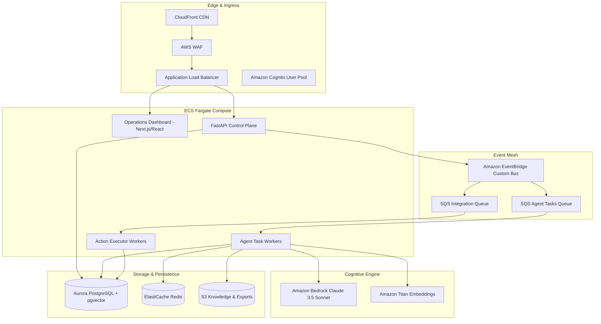

# Solution Architecture Specification

## 1. System Overview
The **AI-Powered Autonomous E-Commerce Operations Platform** is an event-driven, multi-agent control plane designed to observe, analyze, propose, approve, and execute operational workflows across e-commerce enterprises.

## 2. Core Architectural Principles
1. **Separation of Reasoning and Execution**: LLMs generate structured, schema-validated JSON action proposals. They have zero direct access to external production write APIs.
2. **Deterministic Arithmetic**: Numerical metrics (lead-time demand, safety stock, days of cover, contribution margins, carrier multi-attribute scorecards) are computed in verified Python functions.
3. **Idempotency & Exactly-Once Execution**: Every proposed action includes an immutable `idempotency_key`. The execution engine checks and locks against duplicate execution.
4. **Row-Level Security (RLS)**: Every tenant query runs inside a session setting `app.tenant_id = :tenant_id`, enforced by PostgreSQL database engine policies.
5. **Human-in-the-Loop (HITL)**: All destructive external actions default to Autonomy Level 2 (Approve then execute), staging proposals into the Operations Inbox.

## 3. Component Details
- **Control Plane API (`apps/api`)**: Built with FastAPI, Pydantic v2, and SQLAlchemy. Provides RESTful endpoints for telemetry, agent run inspection, approval decisions, and webhook ingress.
- **Operations Dashboard (`apps/web`)**: Built with React, TypeScript, and modern glassmorphic vanilla CSS. Provides domain consoles for Inventory, Orders, Support RAG, Dynamic Pricing, and Approvals.
- **Agent Brain (`brain/`)**: Modular specialist agents supervised by `SupervisorOrchestrator` using a deterministic event routing matrix.
